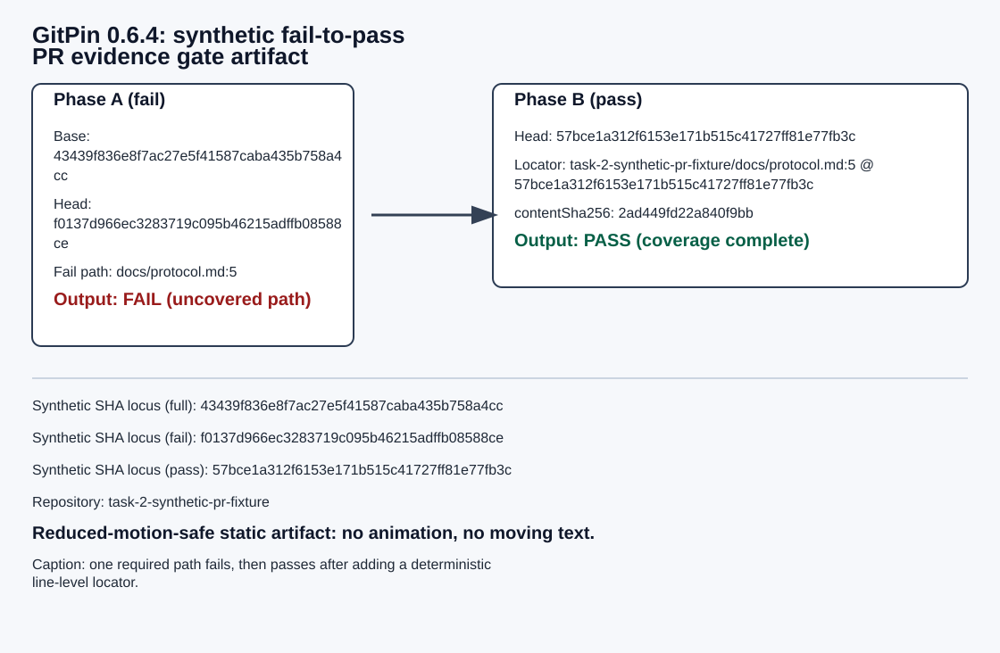

# Synthetic PR evidence gate demo artifact

## Purpose

Deterministic, synthetic fail-to-pass artifact for the GitPin v0.6.0 PR evidence gate.

## Accessibility

- Alternate text is provided in `docs/demos/pr-gate-fail-to-pass.artifact.json:accessibility.altText`.
- Caption is provided in `...artifact.json:accessibility.caption`.
- No animation is required. The artifact is static and text-readable.

## Static visual

<figure>
  
  <figcaption>
    Static deterministic PR evidence gate flow for a synthetic repository. Phase A fails because `docs/protocol.md` is uncovered. Phase B passes after adding a locator for `docs/protocol.md:5` on commit `bab63b08...`.
  </figcaption>
</figure>

## Phase A: fail

```bash
gitpin gate --base 982608f3b7521706cabbc39cd0ccf4b4036898fa --head bab63b08df51151b6b375f2b6376fb441bcf3a8e
```

```text
FAIL: material path is uncovered: docs/protocol.md
```

## Phase B: pass

```json
{
  "repository": "task-2-synthetic-pr-fixture",
  "path": "docs/protocol.md",
  "lineStart": 5,
  "lineEnd": 5,
  "sha": "bab63b08df51151b6b375f2b6376fb441bcf3a8e",
  "contentSha256": "3abe23f770304e0849977cb46aac0cf5dc4a4d0ce7b92a8bf12f6960386f5ce1"
}
```

```bash
gitpin gate --base 982608f3b7521706cabbc39cd0ccf4b4036898fa --head bab63b08df51151b6b375f2b6376fb441bcf3a8e
```

```text
PASS: checked 1 claim manifest entry for 1 required changed path.
```

## Reduced-motion / static fallback

- For reduced-motion readers: read the two command/output blocks directly above.
- For tooling checks: consume `pr-gate-fail-to-pass.artifact.json` and validate fields:
  - `failCase.status === 1`
  - `passCase.status === 0`
  - `passCase.coverage.sha === "bab63b08df51151b6b375f2b6376fb441bcf3a8e"`
  - exact `passCase.coverage.lineStart` and `passCase.coverage.lineEnd` remain on `docs/protocol.md`.
