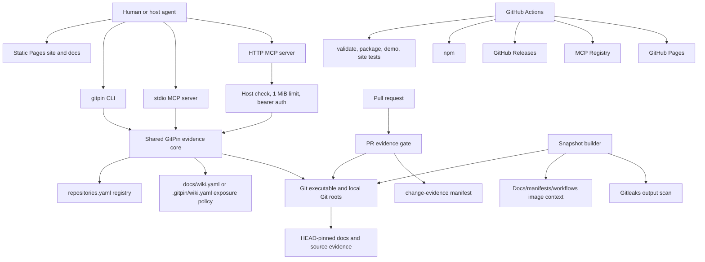
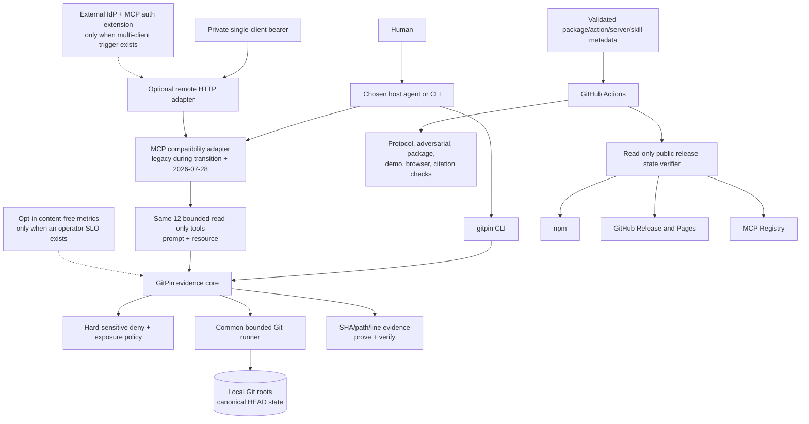

# GitPin Agentic-AI Architecture and Modernization Assessment

**Assessment date:** 2026-08-28 (America/Chicago)  
**Repository:** `C:\Repos\shmindmaster\gitpin` only  
**Assessed Git revision:** `defb193a7ed89d8b9bb821994f224b6ace1d2dfe` — this was the actual local-checkout revision assessed, but it was never pushed and is not reachable from `origin/main` history, so `git cat-file -e defb193a7ed89d8b9bb821994f224b6ace1d2dfe` fails on a fresh downstream clone.  
**Reproducible citation anchor:** `4de3ee8f9941e4d9b180e6c119b3370b647a7b6a` — reachable on `origin/main` (merged as PR #53). `git diff defb193a7ed89d8b9bb821994f224b6ace1d2dfe 4de3ee8f9941e4d9b180e6c119b3370b647a7b6a --stat` shows the two trees differ only in `.gitpin/change-evidence.json`, which no citation below cites by line range; every `path:line-range` citation in this document therefore resolves to byte-identical content at this reachable commit. Re-verify any citation with `git show 4de3ee8f9941e4d9b180e6c119b3370b647a7b6a:<path>`.  
**Branch state at start:** local `main` was one commit ahead of and one commit behind the then-known `origin/main`; it was deliberately not reconciled.  
**Change boundary:** assessment document and documentation-index link only; no production code, dependency, configuration, release, deployment, registry, or other external-system change.  
**Status vocabulary:** **Observed** = exercised or live-checked; **Implemented** = verified in source; **Documented** = repository prose; **Inferred** = reasoned from evidence; **Unknown** = not established.  
**Confidence:** **High** requires current source plus current external-product evidence when an external dependency is material; **Medium** has one inferred material dimension; **Low** is a hypothesis or inaccessible runtime claim.

## Method and evidence boundaries

RepoWise was used first for architecture, symbol, dependency, security, integration, workflow, CI/CD, and duplication discovery. Its index reported revision `defb193a7ed89d8b9bb821994f224b6ace1d2dfe`, 82 pages, and 146 indexed files. Architecture retrieval was weak/low-confidence and security retrieval was only medium-confidence; in particular, broad conceptual queries under-described transport policy, release workflows, and snapshot selection. RepoWise did accurately route to files such as `src/snapshot-files.ts`, `scripts/verify-ci-runner-routing.mjs`, and `scripts/demo-workflow.mjs`. Every material finding below was therefore rechecked against the current source. RepoWise is a navigation aid here, not the evidence authority.

Repository citations use `path:line-range` and refer to the assessed SHA above; because that SHA is unreachable from a downstream clone, reproduce them against the reachable citation anchor given above instead. External links are current primary sources as of the assessment date. Live public checks covered npm, GitHub Releases, GitHub Pages, and the Official MCP Registry. No private/client data was used; runtime validation used repository-native synthetic fixtures. Production traffic, private deployment configuration, consumer telemetry, and portfolio-wide duplication were unavailable or out of scope.

The weighted opportunity score is `impact×25% + engineering leverage×20% + reliability/security×15% + architectural fit×15% + strategic leverage×10% + time-to-value×5% + cost/performance×5% + reversibility×5%`, with each factor scored 0–5 and normalized to 100. Factor vectors appear as `I/E/R/A/S/T/C/V` so arithmetic is reproducible.

---

## 1. Executive Assessment

GitPin is a strong, deliberately compact evidence product, not an autonomous agent. Its architecture is modern where the product needs it to be: a TypeScript/Node package, 12 bounded read-only MCP tools, HEAD-pinned Git reads, fail-closed exposure policy, a local stdio surface, a bearer-authenticated stateless HTTP surface, a PR evidence gate, deterministic snapshot packaging, and disciplined release workflows. The absence of a model runtime, database, embeddings, durable agent loop, memory service, connector platform, and workflow engine is intentional scope—not missing plumbing. `docs/architecture.md:3-17` states this contract and the source supports it.

The highest-value modernization is at the protocol and trust edges. The repository uses `@modelcontextprotocol/sdk` 1.30.0 (`package.json:83-95`) while the MCP ecosystem has moved to the [2026-07-28 stateless core](https://blog.modelcontextprotocol.io/posts/2026-07-28/) and the TypeScript SDK's [modern v2 package generation](https://github.com/modelcontextprotocol/typescript-sdk/blob/main/docs/protocol-versions.md). GitPin's per-request stateless HTTP construction is directionally aligned, so this is an incremental compatibility migration rather than an architectural rewrite.

Security fundamentals are good: subprocesses use argument arrays rather than a shell; Git content is read at a resolved SHA; filesystem traversal rejects symlink/root escapes; exposure policy blocks secret patterns and fails closed; request size and bearer authentication are enforced; and this repository's own CI/release actions are SHA-pinned. Concrete gaps remain: an empty host allowlist permits every host, unauthenticated health output reveals repository counts and names on some failures, remote auth is one static bearer secret, Git subprocess limits are inconsistent, repository instructions/skills are not explicitly treated or tested as untrusted inputs, and the published composite action's own `actions/setup-node@v7` dependency is pinned only to a floating tag, not a commit (§8 gap 8).

The public release state is healthier than the durable documentation at the assessed revision says. **Observed on 2026-08-28:** npm `gitpin@0.6.3`, immutable GitHub Release `v0.6.3`, MCP Registry `io.github.shmindmaster/gitpin@0.6.3`, and the Pages site all resolve successfully. At the assessed revision, `AGENTS.md:5-10` and `docs/current-state.md:1-18` still said MCP Registry and Pages publication were pending/0.6.2. This was a current-state evidence drift defect, not a deployment defect. **Already corrected on `origin/main` before this assessment date, but absent from the pinned revision:** commit `7b57f3a` ("docs(release): record verified v0.6.3", PR #54, 2026-08-18 09:55 America/Chicago — 31 minutes after the assessed revision and ten days before this assessment date) updated both files to name 0.6.3 as verified across npm, the MCP Registry, GitHub Releases, and Pages; `origin/main` carried this correction throughout the assessment window, and `docs/current-state.md:12-13` reads correctly as of this document's own HEAD. The finding is retained here — not because the docs are still wrong, but because the assessed revision was deliberately pinned above instead of reconciled with `origin/main` (see line 6), and because the underlying gap it exposes — nothing *automatically* keeps durable docs aligned with live release state — is unchanged; that gap is opportunity 2 in §4.

Top priorities are: (1) preserve the Git-only/index-free core while migrating deliberately to MCP 2026-07-28 and SDK v2; (2) turn public release state into an automated, read-only truth check; (3) add deterministic adversarial tests for tool/instruction/repository-content trust; (4) harden the remote HTTP health/host/auth policy; and (5) consolidate Git subprocess execution and validate the shipped Agent Skill. Do not add LangGraph, a managed agent runtime, Convex, RAG/memory, connector middleware, an authorization database, a sandbox product, an agent gateway, or an observability SaaS without a concrete future boundary that requires it.

## 2. Current Architecture

### Architecture and ownership

GitPin has three consumer surfaces over one evidence core: static website/documentation, CLI, and MCP. The CLI initializes and diagnoses repositories and verifies briefs; the stdio MCP server exposes local source according to repository policy; the HTTP server exposes a bounded snapshot-oriented surface with bearer authentication. The core resolves configured Git roots, reads committed HEAD content, applies hard-sensitive and repository exposure rules, constructs commit-pinned citations/evidence sets, and re-verifies them. The PR gate applies policy from the trusted base and evidence manifests from the head. Snapshot creation selects only documentation/manifests/workflows and scans the staged output. GitHub Actions validate, package, release to npm/GitHub, publish MCP metadata, and deploy Pages.



**Implemented evidence:** the server registers 12 tools and one prompt before connecting stdio (`src/server.ts:10-43`); exact tool names and bounded descriptions live in `src/pin-tools.ts:47-279`; the prescribed prove/verify loop is explicit in `src/pin-prompt.ts:3-24`. Registry discovery and Git-root resolution are in `src/registry.ts:35-78`. The hard-sensitive list and fail-closed malformed-policy behavior are in `src/policy.ts:3-80`. HEAD-only reads and root/symlink containment are in `src/git-shared.ts:77-187`; bounded repository discovery is in `src/git-shared.ts:202-246`. Snapshot inclusion is docs/manifests/workflows-only (`src/snapshot-files.ts:4-39`).

### Repository/service relationship map

| Surface | Owner in this repo | State/data boundary | External dependency |
| --- | --- | --- | --- |
| Static website | `site/`, `scripts/build-site.mjs` | Build-time static assets; optional allowlisted analytics | GitHub Pages; optional PostHog endpoint |
| CLI | `src/cli.ts`, onboarding/doctor/brief modules | Local files explicitly initialized by user; Git reads | Node and Git |
| stdio MCP | `src/server.ts`, `src/pin-tools.ts` | Local registry and exposed committed content | MCP host process |
| HTTP MCP | `src/http.ts` | Stateless request; environment-held token; snapshot registry | HTTP client/reverse proxy |
| Evidence core | `src/git-*.ts`, evidence/wiki modules | Git object database is canonical; no application DB | Git executable, `simple-git` |
| PR gate | `src/gate.ts`, `action.yml` | Trusted base policy + head evidence manifest | GitHub Actions/Git history |
| Snapshot builder | `src/snapshot.ts`, `src/snapshot-files.ts` | Dedicated generated output only | Git, optional/required gitleaks in release use |
| Delivery | `.github/workflows/*.yml` | npm/GitHub/MCP/Pages metadata and artifacts | GitHub OIDC, npm, registries |

### Technology and boundary inventory

| Layer | Current technology | Observation |
| --- | --- | --- |
| Runtime | Node `>=20`, TypeScript | Package metadata is coherent (`package.json:1-49`); CI covers Node 20/22/24 (`.github/workflows/ci.yml:53-69`). |
| Protocol | MCP SDK 1.30.0; stdio + Streamable HTTP | Stateless per HTTP request (`src/http.ts:93-112`); modern MCP migration is pending. |
| State | Git HEAD and YAML manifests | No DB, cache, queue, vector store, or worker; correct for immutable evidence. |
| Authentication | Runtime bearer token | Constant-time comparison (`src/http.ts:115-137`); no user/tenant/delegation model. |
| Authorization | Exposure policy + hard deny | Resource/path authorization, not actor authorization (`src/policy.ts:3-80`). |
| Secrets | Environment and GitHub OIDC | No committed secret store; release jobs use minimal job permissions (`.github/workflows/release.yml:14-38`). |
| CI/CD | GitHub Actions, pnpm, Vitest, Playwright, Biome | SHA-pinned actions; validate/package/runtime/site matrices (`.github/workflows/ci.yml:1-91`). |
| Delivery | npm, GitHub Release, MCP Registry, Pages | All four publicly observed at 0.6.3; durable docs were stale at the assessed revision, corrected pre-assessment by commit `7b57f3a` (see §1). |
| Observability | Process errors, CI artifacts; optional site analytics | No product telemetry or trace backend; appropriate now. Website analytics is allowlisted/optional (`site/privacy.html:51-83`). |
| Agent assets | 12 MCP tools, one prompt, one skill template, AGENTS instructions | Versioned in Git; trust/provenance metadata is incomplete. |

Major ownership conclusion: GitPin owns evidence resolution and verification. The MCP host owns model behavior, planning, approvals, and user identity. Git/GitHub own canonical repository and delivery state. Adding an internal agent runtime would collapse these boundaries and weaken the product's useful neutrality.

## 3. Agentic Maturity Scorecard

A low score means “not provided by GitPin,” not automatically “defective.” GitPin is an agent **capability server** rather than an agent.

| Capability | Score | Evidence and interpretation |
| --- | ---: | --- |
| Model integration | 0 | No model SDK/call is present; deliberate host responsibility. |
| Tool use | 5 | Twelve bounded `pin.*` tools plus resource and exact-evidence prompt (`src/pin-tools.ts:47-279`; `src/pin-prompt.ts:3-24`). |
| Planning/reasoning | 1 | A prescribed evidence sequence exists, but no in-process planner (`src/pin-prompt.ts:3-24`). |
| Durable agent execution | 0 | No agent loop/checkpoint/runtime; synchronous requests are correct product scope. |
| Human approval/intervention | 2 | PR review/gate supplies an external human boundary; GitPin itself has no approval UI. |
| Persistent memory | 0 | Intentionally absent; Git commits/evidence are canonical state, not agent memory. |
| RAG/retrieval | 3 | Deterministic Git/doc/code retrieval exists; no semantic/vector RAG by design. |
| Context management/compaction | 3 | Bounded slices, result limits, evidence sets, and snapshots constrain context; no model compaction. |
| SaaS connectivity | 1 | Delivery services only; no end-user connector code. |
| Dynamic capability creation | 0 | Fixed, reviewed tool contract; autonomy here would be counterproductive. |
| Agent-to-agent interoperability | 0 | No independently deployed agents; A2A is not applicable. |
| Agent UI/realtime | 1 | Static site and MCP responses only; no agent session UI. |
| Agent identity/delegation | 1 | HTTP authenticates a token but does not model human/agent/delegator identity. |
| Authorization | 3 | Strong path/exposure enforcement, but no actor/tenant policy (`src/policy.ts:3-80`). |
| Agent security | 4 | Read-only tools, HEAD pins, sensitive deny, bounded paths, and CI checks; instruction/tool-content threat tests should improve. |
| Observability | 2 | Deterministic CLI/CI results and error responses; no portable request metrics/traces. |
| Evaluation | 4 | 93 unit tests plus package/demo/site gates; no host-model task-quality dataset. |
| Optimization/improvement | 2 | Regression gates exist, but no measured production feedback loop. |
| Event-driven operation | 2 | PR/release/workflow events exist externally; runtime is request-driven and stateless. |

**Loop assessment:** Action loop = 2/5 (the host observes/reasons; GitPin acts by retrieval but does not remember). Capability loop = 1/5 (capabilities are manually reviewed/versioned, which is appropriate). Improvement loop = 3/5 (strong deterministic regression suite, weak production feedback). None justifies importing an agent framework.

## 4. Ranked Opportunities

| Rank | Opportunity | Type | Technology | Score | Effort | Risk | Confidence |
| ---: | --- | --- | --- | ---: | ---: | ---: | --- |
| 1 | Migrate through a dual-era MCP compatibility pilot | PILOT → ADOPT | MCP 2026-07-28 + TS SDK v2 | 95 | 3 | 3 | High |
| 2 | Automate public release-state truth | DX / RELIABILITY | Native scripts + official APIs | 88 | 2 | 1 | High |
| 3 | Add agentic trust/adversarial regression coverage | SECURITY FIX | Deterministic tests + OWASP baseline | 87 | 3 | 2 | High |
| 4 | Harden remote HTTP metadata and host policy | SECURITY FIX | Existing HTTP layer | 82 | 2 | 2 | High |
| 5 | Validate and govern the shipped Agent Skill | DX / SECURITY | Agent Skills spec + `skills-ref` | 81 | 2 | 1 | High |
| 6 | Consolidate production Git subprocess policy | CONSOLIDATE | Native Node subprocess wrapper | 81 | 3 | 2 | High |
| 7 | Add privacy-safe operational signals behind opt-in | PILOT | Structured metrics / OpenTelemetry API | 79 | 2 | 1 | Medium |
| 8 | Unify version/provenance metadata across agent assets | CONSOLIDATE | Generated metadata validation | 78 | 2 | 1 | High |
| 9 | Design a trigger-based remote OAuth path | FUTURE OPTION | MCP authorization extension | 71 | 4 | 3 | Medium |
| 10 | Plan removal of the `repocontext` migration alias | REFACTOR | Native deprecation cycle | 66 | 3 | 3 | Medium |

### 1 — Dual-era MCP compatibility pilot (95; `5/5/4/5/5/4/4/5`)

- **Current/evidence:** SDK 1.30.0 is declared in `package.json:83-95`; stdio and stateless Streamable HTTP are created in `src/server.ts:10-43` and `src/http.ts:93-112`; `server.json:1-30` describes only stdio publication.
- **Problem:** the ecosystem's current standard is MCP 2026-07-28, whose stateless core, discovery, routing headers, cacheable lists, auth hardening, and extension model differ from the legacy protocol era. Remaining on the legacy SDK eventually narrows client interoperability.
- **Recommendation/why:** build a branch-local compatibility spike using the TS SDK v2 packages, pin and test legacy plus modern negotiation, then migrate without changing the 12 tool schemas. GitPin's existing stateless design minimizes conceptual change.
- **Alternatives:** freeze v1 (short-term safe, accumulating compatibility debt); adopt a managed agent runtime (reject—wrong layer); expose more tools (reject—unrelated).
- **Value/effort/risk:** future client compatibility and simpler alignment with the official protocol; medium implementation, moderate client risk.
- **Dependencies/migration:** create a protocol fixture matrix; port server construction; test stdio/HTTP clients; update `server.json`; canary a prerelease; only then change stable. **Rollback:** retain last v1-compatible release and dual-era fixtures.
- **Success metric:** all 12 tools and resource/prompt pass legacy and 2026-07-28 conformance fixtures; no schema/citation regression; package/runtime matrices remain green.

### 2 — Automated public release-state truth (88; `4/5/4/5/3/5/5/5`)

- **Current/evidence:** release and registry workflows already verify tag, main, npm artifact, checksum, and live registry (`.github/workflows/release.yml:39-73`; `.github/workflows/publish-mcp.yml:32-78`). Yet at the assessed revision `AGENTS.md:5-10` and `docs/current-state.md:1-18` contradicted live 0.6.3 availability, and it took a hand-written follow-up commit (`7b57f3a`) to correct them — which is the recurring cost this opportunity removes, not a one-off.
- **Problem:** operational truth is manually duplicated and can remain stale after successful publication.
- **Recommendation/why:** add one read-only script that queries official npm, GitHub Release, Pages, and MCP Registry endpoints, emits a machine-readable matrix, and optionally verifies a generated current-state block. Keep publishing manual/authorized.
- **Alternatives:** edit docs after each release (already failed); make deployment automatic (unnecessary scope expansion).
- **Value/effort/risk:** eliminates false launch claims and shortens release verification; low effort/minimal risk.
- **Dependencies/migration:** define timeout/offline semantics; initially advisory, then gate only release-state assertions. **Rollback:** remove the advisory job; no runtime effect.
- **Success metric:** documented public versions equal live endpoints or CI reports an explicit unavailable state within one run.

### 3 — Agentic trust/adversarial regression suite (87; `4/4/5/5/4/4/4/5`)

- **Current/evidence:** sensitive patterns are blocked and malformed policy fails closed (`src/policy.ts:3-80`); root/symlink containment exists (`src/git-shared.ts:157-187`); the prompt forbids invented content (`src/pin-prompt.ts:3-24`).
- **Problem:** repository docs, tool metadata, `AGENTS.md`, and skill text can carry hostile instructions. Current architectural controls constrain file access but do not explicitly test that untrusted content cannot change authority, forge a citation, request a write, or escape the expose policy.
- **Recommendation/why:** map the [OWASP Top 10 for Agentic Applications 2026](https://genai.owasp.org/resource/owasp-top-10-for-agentic-applications-for-2026/) to GitPin's actual responsibilities and add deterministic fixtures for instruction injection, misleading tool text, Unicode/path tricks, symlink escapes, malicious YAML, stale/ref ambiguity, secret-shaped paths, oversized inputs, and cross-repo citation mix-ups. Use Promptfoo only later for a host-plus-model integration suite.
- **Alternatives:** NeMo Guardrails (reject—no model loop); Promptfoo-only red team (insufficient architectural control).
- **Value/effort/risk:** protects GitPin's core evidence claim with low-lock-in tests; medium effort/low migration risk.
- **Dependencies/migration:** threat-model table first, fixtures second, CI gate third. **Rollback:** individual fixtures can be quarantined without weakening runtime boundaries.
- **Success metric:** every applicable OWASP category maps to a control/test/explicit non-applicability; all adversarial fixtures fail closed.

### 4 — Remote HTTP metadata and host-policy hardening (82; `3/4/5/5/3/5/5/5`)

- **Current/evidence:** `/healthz` precedes host and auth checks and returns repository/document counts; some errors include repository names (`src/http.ts:18-52`). An empty allowed-host set permits all hosts (`src/http.ts:148-158`); request size, POST-only MCP, and token checks are otherwise present (`src/http.ts:54-90`).
- **Problem:** anonymous operational metadata is more detailed than necessary, and permissive empty-host behavior makes deployment safety depend on documentation/proxy configuration.
- **Recommendation/why:** return only generic liveness anonymously; place detailed readiness behind authentication; require an explicit allowed-host policy in documented remote/production mode; document TLS and reverse-proxy ownership. Do not invent multi-tenant auth.
- **Alternatives:** put every route behind auth (hurts basic liveness); deploy an agent gateway (disproportionate).
- **Value/effort/risk:** reduces reconnaissance/misconfiguration without changing the tool contract; low effort/low risk.
- **Dependencies/migration:** add compatibility tests, introduce a warning period for empty allowlists, then fail closed only when remote mode is explicitly selected. **Rollback:** restore detailed health while retaining auth/host tests.
- **Success metric:** anonymous health reveals no repository identity/count; production-mode startup rejects absent host policy; existing clients pass.

### 5 — Agent Skill validation and governance (81; `3/4/4/5/4/5/5/5`)

- **Current/evidence:** `templates/gitpin-skill.md:1-40` supplies a reusable evidence procedure; `AGENTS.md` is the repository instruction authority and `CLAUDE.md:1` imports it. The skill has required name/description but no explicit license, compatibility, owner/version metadata, or trust warning.
- **Problem:** a distributed procedural asset can drift from the tool contract and is part of the agent supply chain.
- **Recommendation/why:** validate it against the [Agent Skills specification](https://agentskills.io/specification), add license/compatibility/version/provenance metadata supported by the spec, document that repository content is untrusted data, and check referenced tool names in CI.
- **Alternatives:** embed all procedure in the MCP prompt (less portable); create provider-specific skills (duplication).
- **Value/effort/risk:** portable, testable capability guidance with little complexity; low effort/minimal risk.
- **Dependencies/migration:** first add validator/advisory, then metadata, then release check. **Rollback:** keep the current valid minimal frontmatter.
- **Success metric:** official validator passes; every referenced tool exists; skill version matches package release or an explicit compatibility range.

### 6 — Consolidated production Git subprocess policy (81; `3/5/4/5/3/4/4/5`)

- **Current/evidence:** direct Git execution is repeated across `src/git-shared.ts`, `src/git-content.ts`, `src/wiki-index.ts`, `src/wiki-search.ts`, `src/evidence-verify.ts`, `src/documentation-analysis.ts`, `src/gate-policy.ts`, `src/snapshot.ts`, and onboarding. Some calls have timeouts/limits/`--no-replace-objects` or `--no-optional-locks`; others do not (`src/git-content.ts:100-163`; `src/gate-policy.ts:85-97`; `src/snapshot.ts:211-220`). `simple-git` is also meaningfully used for history/inspection.
- **Problem:** inconsistent timeout, buffer, environment, safe flags, and error normalization make denial-of-service and maintenance behavior uneven.
- **Recommendation/why:** create one small production Git runner with command-class limits and safe defaults; migrate direct execution incrementally. Keep `simple-git` until its higher-level history/inspection usage is independently proven redundant.
- **Alternatives:** replace everything with `simple-git` (does not guarantee policy); shell out through one generic command string (reject—unsafe); rewrite Git access in a library (unnecessary).
- **Value/effort/risk:** removes repeated plumbing and centralizes safety; medium effort/low risk.
- **Dependencies/migration:** characterize current commands/tests, introduce wrapper, migrate one module at a time. **Rollback:** revert each call site independently.
- **Success metric:** all production Git subprocesses have explicit time/buffer ceilings and common error codes; no command-schema regression; fewer duplicate wrappers.

### 7 — Privacy-safe operational signals (79; `3/4/4/5/4/4/4/5`)

- **Current/evidence:** runtime is effectively uninstrumented beyond errors; the site explicitly limits optional analytics (`site/privacy.html:51-83`).
- **Problem:** a remote operator cannot measure latency, error class, request size, tool name, or availability without content-bearing logs.
- **Recommendation/why:** pilot content-free structured counters/timers and an optional OpenTelemetry API adapter: operation name, status, latency, size bucket, protocol version, and anonymous instance version only. Never capture query, path, source text, token, or evidence content by default. Full OpenInference is not appropriate because GitPin has no model spans.
- **Alternatives:** Langfuse/LangSmith/Phoenix (no agent/model loop to observe); raw request logging (privacy risk).
- **Value/effort/risk:** enough SLO evidence to justify later infrastructure; low effort/minimal runtime risk, but value is inferred until remote usage exists.
- **Dependencies/migration:** privacy review and opt-in interface. **Rollback:** disable/no-op exporter.
- **Success metric:** p50/p95 latency, error rate, and tool-call counts measurable with zero content fields; default remains disabled.

### 8 — Unified agent-asset version/provenance validation (78; `3/4/3/5/4/5/5/5`)

- **Current/evidence:** version/capability metadata is repeated in `package.json`, `src/server.ts`, `server.json`, `action.yml`, the skill, release tags, and docs. Existing scripts validate several pairs, but the skill/instruction compatibility surface is not part of one inventory.
- **Problem:** metadata drift can make clients discover the wrong protocol, version, or capability guidance.
- **Recommendation/why:** generate or validate—not runtime-centralize—a small asset manifest covering package, MCP server, tool count, prompt, skill, action, protocol era, owner, license, and lifecycle.
- **Alternatives:** an internal registry service (reject); manual review (drift-prone).
- **Value/effort/risk:** improves supply-chain clarity using repository-native checks; low effort/minimal risk.
- **Dependencies/migration:** define schema, validate existing assets, add CI. **Rollback:** retain existing independent verifiers.
- **Success metric:** one command detects version/tool/protocol/owner drift across all shipped agent assets.

### 9 — Trigger-based remote OAuth path (71; `3/3/5/4/4/2/3/4`)

- **Current/evidence:** one environment bearer token authenticates all HTTP callers (`src/http.ts:115-137`); there is no tenant/user/delegation state.
- **Problem:** static shared bearer auth is insufficient only if GitPin becomes a public multi-client service requiring revocation, scoped clients, or enterprise-managed credentials.
- **Recommendation/why:** design, but do not yet implement, the official [MCP authorization extension](https://modelcontextprotocol.io/extensions/auth/overview) and client-credentials profile as the upgrade path. Prefer an existing identity provider/reverse proxy over embedding an authorization server.
- **Alternatives:** OpenFGA/SpiceDB/Cerbos (resource authorization scale not present); SPIFFE (multi-workload mesh absent); keep token (correct today).
- **Value/effort/risk:** future standards alignment; high effort/moderate interoperability risk, so trigger-based.
- **Trigger/migration:** require multiple independent clients, per-client revocation/scopes, or enterprise identity. Dual-auth transition, then expire static tokens. **Rollback:** retain token mode for local/private deployments.
- **Success metric:** when triggered, each client has revocable scoped identity and audit attribution without exposing credentials to tool content.

### 10 — Planned `repocontext` alias retirement (66; `3/4/2/4/3/3/4/4`)

- **Current/evidence:** the legacy alias/environment naming appears 94 times across 34 files in `src`, scripts, docs, templates, package/action/server metadata. Package metadata intentionally ships both `gitpin` and `repocontext` binaries (`package.json:28-32`).
- **Problem:** a permanent migration layer increases terminology, test, configuration, and documentation surface.
- **Recommendation/why:** measure usage if a privacy-safe signal becomes available, publish a major-version deprecation plan, migrate docs/config first, then remove only after an announced window. Do not do a rename-only sweep now.
- **Alternatives:** immediate removal (high consumer break risk); keep forever (ongoing debt).
- **Value/effort/risk:** eventual simplification; medium effort and moderate compatibility risk, hence last.
- **Dependencies/migration:** explicit policy, warnings, migration command, major release. **Rollback:** restore alias in a patch if downstream breakage appears.
- **Success metric:** zero first-party references except migration docs before removal; no unresolved consumer reports during the deprecation window.

## 5. Ranked Refactors

| Rank | Refactor | Verified scope | Decision | Expected deletion/consolidation |
| ---: | --- | --- | --- | --- |
| 1 | Common production Git runner | 9 production modules; representative files total over 1,400 lines, but only wrapper call sites change | CONSOLIDATE | Replace repeated option/error scaffolding; do not speculate LOC until spike |
| 2 | Generated/validated release and agent-asset metadata | `package.json`, `src/server.ts`, `server.json`, `action.yml`, skill, release/current-state docs | CONSOLIDATE | Delete manual version/protocol assertions where generation is authoritative |
| 3 | Split anonymous liveness from authenticated readiness | `src/http.ts` (179 lines) and focused tests | SECURITY FIX | Simplify public health payload; retain bounded diagnostics privately |
| 4 | Legacy alias retirement | 94 matches in 34 files | LATER REFACTOR | Eventual deletion of alias branches/tests/docs after major-version gate |
| 5 | `simple-git` replacement | Used by history/inspection modules | KEEP CURRENT | No evidence that a rewrite deletes net complexity today |
| 6 | Core evidence/index-free architecture | Git/policy/evidence modules | KEEP CURRENT | Avoid replacement; this is the differentiating design |

Line counts bound file scope, not implementation size. Affected LOC should be estimated only after symbol/reference mapping in the implementation sprint. No cross-repository duplicate refactor is claimed.

## 6. Integration Opportunities

GitPin has no bespoke end-user OAuth, webhook, pagination, SaaS retry, or connector estate to replace. npm, GitHub, MCP Registry, Pages, optional PostHog, and gitleaks are infrastructure integrations with native APIs/CLIs and do not justify a connector platform.

| Rank | Integration | Current implementation | Recommended path | Maintenance/product value |
| ---: | --- | --- | --- | --- |
| 1 | Public release verification | Separate workflow/scripts and stale prose | Official npm/GitHub/MCP/HTTP APIs in one read-only verifier | High |
| 2 | MCP client interoperability | SDK v1 generation | Official MCP SDK v2 and conformance fixtures | High |
| 3 | Remote identity, if triggered | Static bearer token | Existing IdP/proxy + MCP auth extension | Medium, future |
| 4 | Runtime metrics, if operated remotely | Errors only | Optional OTel-compatible metrics interface | Medium, conditional |
| 5 | Nango / Activepieces / Pipedream / Composio / Airbyte | No equivalent responsibility exists | NOT NEEDED | Negative value now; adds auth/data/workflow surface |

Capability resolution should remain: native Git operation → bounded MCP tool → official structured service API for release verification → controlled operator action. Browser/computer automation and connector middleware have no justified place in the normal product path.

## 7. Agentic Product Opportunities

GitPin should increase **evidence autonomy**, not become a general-purpose agent. The target behaviors below remain host-directed and read-only.

| Opportunity | Current → target behavior | Tools/context | Authorization and approval | Success metric |
| --- | --- | --- | --- | --- |
| Protocol-aware evidence session | Host manually sequences tools → compatible clients discover the contract and execute catalog/candidate/prove/verify reliably | Existing 12 tools, exact-evidence prompt, MCP discovery/cache metadata | Exposure policy enforced in GitPin; user/host controls invocation; no write approval needed | ≥99% conformance-fixture completion across supported protocol eras |
| Release truth brief | Maintainer checks four destinations → one command produces a dated, source-labeled release matrix | Official npm, GitHub, MCP Registry, Pages endpoints; no memory | Read-only public access; publishing remains separately approved | Four-surface state in <30 seconds with unavailable vs absent distinguished |
| Security evidence brief | Individual tests → one threat-model/evidence report maps controls to adversarial fixtures | GitPin tests, policy fixtures, OWASP checklist | CI owns pass/fail; human reviews new threat mappings | 100% applicable threats have test/control/accepted-risk owner |
| Multi-repo evidence brief | Host assembles citations → `pin.analyze`/evidence sets produce a closed verified decision packet | `pin.catalog`, search, prove/set, verify/set, analyze | Registry/exposure policy; human owns the resulting decision | Every factual claim has full SHA/path/line and verification status |
| Consumer compatibility doctor | CLI checks local configuration → doctor also identifies protocol/skill/asset compatibility | Local package metadata and fixtures only | Local read-only execution | Actionable diagnosis for every supported client fixture |

No persistent memory is required: evidence sets and Git SHAs are explicit artifacts. No human approval should be embedded for read operations; approval belongs at the host or PR/release action boundary. Dynamic adapter generation, autonomous deployment, and write tools would contradict the product contract.

## 8. Security Gaps

The assessment uses the OWASP Agentic Applications 2026 categories as a baseline but scopes them to a non-model, read-only tool server. Guardrails do not replace enforcement; most controls belong in deterministic code/tests.

| Rank | Gap | Evidence | Consequence | Recommended control | Severity/confidence |
| ---: | --- | --- | --- | --- | --- |
| 1 | Untrusted repository instructions/tool content not explicitly threat-modeled | GitPin exposes committed text and ships instructions/skill (`src/pin-prompt.ts:3-24`; `templates/gitpin-skill.md:1-40`) | A host model could follow hostile content even though GitPin itself remains read-only | Mark content as untrusted data in tool/skill contracts; add injection/forged-citation fixtures; keep authority outside content | High / High |
| 2 | Empty allowed-host list permits all hosts | `src/http.ts:148-158` | Misconfigured remote deployment loses a useful host-header defense | Explicit remote-mode allowlist; warning then fail-closed; proxy/TLS runbook | Medium / High |
| 3 | Anonymous health metadata is over-detailed | `src/http.ts:18-52` runs before host/auth and can reveal counts/names | Reconnaissance and accidental repository-name disclosure | Generic liveness public; detailed readiness authenticated | Medium / High |
| 4 | Static shared bearer has no actor/delegator attribution | `src/http.ts:115-137` | All callers share authority; rotation/revocation is coarse | Keep for private/single-client use; trigger OAuth/client credentials when multiple clients/scopes appear | Medium / High |
| 5 | Git subprocess resource/security options vary | Multiple wrappers; compare `src/gate-policy.ts:85-97`, `src/git-content.ts:100-163`, `src/snapshot.ts:211-220` | Large/pathological repositories may yield inconsistent availability or replace-ref behavior | Common bounded runner with command-specific limits/safe flags | Medium / High |
| 6 | Agent asset provenance/version is fragmented | Package/server/action/skill metadata are separate | Drift or supply-chain confusion across distributed assets | One validated asset manifest; official skill validator; pinned workflow dependencies | Medium / High |
| 7 | Operational audit is process-level, not caller-level | No request identity or structured metric layer | Incident diagnosis is limited for a remote service | Content-free operation/status/latency metrics; scoped client identity only when needed | Low now / Medium |
| 8 | Published composite action has an unpinned transitive dependency | `action.yml:43` invokes `actions/setup-node@v7` by floating tag, unlike this repository's own SHA-pinned `ci.yml`/`release.yml` | A consumer that pins the GitPin evidence-gate action to a full SHA still inherits whatever commit `actions/setup-node`'s `v7` tag currently resolves to, breaking the reproducibility the SHA pin is meant to guarantee | Pin `actions/setup-node` in `action.yml` to a full commit SHA, matching the standard already applied in `ci.yml`/`release.yml` | Medium / High |

### Controls already working well

- Hard-sensitive paths are denied even if policy allows them; malformed policy denies all (`src/policy.ts:3-80`).
- Git reads resolve HEAD and use object content rather than the dirty working tree (`src/git-shared.ts:77-123`).
- Filesystem traversal enforces containment and rejects symlink escapes (`src/git-shared.ts:157-187`).
- HTTP requires POST for MCP, enforces a 1 MiB body limit, and compares bearer tokens in constant time (`src/http.ts:54-90`, `src/http.ts:115-137`).
- PR policy is read from the trusted base while the manifest comes from the proposed head (`src/gate.ts:24-48`); sensitive evidence locator paths are rejected (`src/gate.ts:95-112`).
- Snapshot selection is restricted before copy, HEAD-only, and followed by a gitleaks scan (`src/snapshot-files.ts:4-39`; `src/snapshot.ts:48-182`).
- This repository's own GitHub Actions workflows use least-scoped job permissions and SHA-pinned actions (`.github/workflows/ci.yml:1-30`; `.github/workflows/release.yml:14-38`). The published composite action does not fully extend this: see gap 8 above.

### Explicit non-gaps

There is no generated-code execution, browser control, model prompt execution, cross-tenant database, RAG/memory store, autonomous write action, or credential-bearing connector in GitPin. E2B/Daytona, NeMo Guardrails, an authorization graph, egress gateway, RAG-poisoning runtime, and browser approval UI do not close a present responsibility. Dependency and compromised-publisher risk remains relevant and is better addressed by pinned CI actions, lockfile/release provenance, and normal supply-chain review.

## 9. Technology Decision Matrix

| Technology | Problem it could solve | Current equivalent | Value | Overlap | Complexity | Decision |
| --- | --- | --- | --- | --- | --- | --- |
| MCP 2026-07-28 / TS SDK v2 | Current/future client interoperability | SDK 1.30.0 | Very high | Direct evolution | Medium | **PILOT, then ADOPT NOW if fixtures pass** |
| MCP Extensions | Optional auth/apps capabilities | Bespoke bearer; no UI | Medium only at a boundary | Partial | Medium | **LATER, negotiate individually** |
| Official MCP Registry | Public server metadata | Already published 0.6.3 | High and realized | None | Low | **KEEP EXISTING** |
| Agent Skills / `skills-ref` | Portable procedure validation | Hand-authored template | High | Complements MCP prompt | Low | **ADOPT NOW** |
| OWASP Agentic Top 10 2026 | Threat-model baseline | Ad hoc security tests | High | None | Low | **ADOPT NOW** |
| Promptfoo | Host/model red-team harness | Deterministic Vitest suite | Medium only for host integration | Significant for server-only tests | Medium | **LATER/PILOT** |
| OpenTelemetry API | Portable content-free runtime metrics | Errors/CI only | Conditional | None | Low–medium | **PILOT when remotely operated** |
| OpenInference | Model/agent/tool span semantics | No model spans | Low | Excessive | Medium | **NOT NEEDED** |
| LangGraph / LangChain / Deep Agents | Agent loop, checkpointing, subagents | Host agent | Negative in server | Duplicates host | High | **REJECT** |
| OpenAI Agents SDK / Vercel AI SDK | Model/tool agent runtime | Host agent | Low | Duplicates host | Medium | **NOT NEEDED** |
| Bedrock AgentCore / Foundry / Vertex Agent Engine / Claude Managed Agents | Managed sessions, sandbox, scaling | Stateless MCP server | Low | Replaces wrong layer | High lock-in | **REJECT** |
| Convex | App state/realtime/workflows | Git is canonical | Negative | Adds second truth | High | **REJECT** |
| Nango / Activepieces / Pipedream / Composio / Airbyte | OAuth/connectors/automation/ingestion | No connector estate | None | Creates new responsibility | Medium–high | **NOT NEEDED** |
| OpenFGA / SpiceDB / Cerbos | Central actor-resource authorization | Path policy + one token | Low at current scale | Adds policy system | High | **NOT NEEDED** |
| SPIFFE/SPIRE | Cross-workload identity | One process/environment token | Low now | Operationally disproportionate | Very high | **FUTURE OPTION** |
| Infisical / OpenBao | Machine-secret lifecycle | Runtime env + GitHub OIDC | Low without operator gap | Duplicates platform secret owner | High | **KEEP PLATFORM EXISTING** |
| Kong AI Gateway / agentgateway | Protocol-aware routing/governance | Direct MCP server/reverse proxy | Low at one service | Extra hop/control plane | High | **NOT NEEDED** |
| LiteLLM / vLLM | Model routing/self-hosting | No models | None | Entirely out of scope | High | **REJECT** |
| Zep/Graphiti / Letta / Qdrant | Memory/temporal/RAG | Git HEAD and evidence sets | Negative | Adds mutable/derived truth | High | **REJECT** |
| Inngest / Hatchet / Temporal | Durable jobs/retries | Short request + GitHub Actions | Low | Adds runtime | High | **NOT NEEDED** |
| MCP Apps / A2UI / AG-UI | Interactive/dynamic agent UI | Static site + host UI | Low today | New product surface | Medium–high | **LATER only if UI demand exists** |
| A2A | Independent-agent delegation | No independent agents | None | New trust boundary | High | **NOT NEEDED** |
| WebMCP / Browserbase / Browser Use | Structured/browsed web actions | Official APIs and no browsing | None | Less deterministic | Medium–high | **REJECT** |
| E2B / Daytona | Untrusted code sandbox | No generated code | None | New runtime | High | **NOT NEEDED** |
| WorkOS | B2B SSO/SCIM/orgs | No SaaS user accounts | None | New identity domain | High | **NOT NEEDED** |
| Firecrawl | Web crawling/ingestion | No web corpus | None | New data pipeline | Medium | **NOT NEEDED** |
| Bun / Rspack | JS runtime/build acceleration | Node/tsc fast enough | Unmeasured | Replaces stable tooling | Medium | **KEEP EXISTING** |
| BuildKit / Railpack / Depot / Blacksmith | Container/CI acceleration | Package/site GitHub Actions | Unmeasured | New build platform | Medium–high | **NOT NEEDED** |

## 10. Do Not Add

1. **No internal model or agent runtime.** GitPin's product is a deterministic capability boundary for whatever host the user chooses. LangGraph, provider agent SDKs, or managed harnesses would couple evidence integrity to an unnecessary model/session layer.
2. **No application database, cache, vector store, or persistent memory.** Git and full SHAs are the canonical truth. Convex, Qdrant, Zep/Graphiti, Letta, or Redis would introduce stale derived state and operations.
3. **No durable workflow engine.** Tool calls are short and synchronous; release/PR work is already owned by GitHub Actions. MCP Tasks, Temporal, Inngest, or Hatchet should appear only if genuinely long-lived/recoverable product work emerges.
4. **No connector platform.** There is no OAuth/SaaS integration estate to consolidate. Nango, Activepieces, Pipedream, Composio, and Airbyte would create rather than remove plumbing.
5. **No centralized authorization database.** The current policy is resource exposure plus one service credential, not a graph of users/organizations/resources. OpenFGA, SpiceDB, and Cerbos are premature.
6. **No agent gateway/service mesh.** One HTTP MCP service does not need Kong AI Gateway, agentgateway, or SPIRE. A normal reverse proxy and platform identity are enough.
7. **No browser/computer automation or web-ingestion layer.** GitPin reads local Git and official release APIs; visual automation would be less deterministic and harder to audit.
8. **No sandbox vendor.** GitPin neither generates nor executes untrusted code. If write/code execution is ever introduced, treat that as a separate product/security decision.
9. **No model observability SaaS.** LangSmith, Langfuse, Phoenix, OpenInference, and DSPy solve model/agent optimization problems the server does not own. Add only content-free operational metrics when an SLO exists.
10. **No build-platform migration without measurement.** `pnpm validate` was not reproducibly green during this assessment: a final full run failed 23 Git-heavy tests on Windows-specific timeouts and temporary-directory `EPERM` cleanup errors, and two subsequent serialized/default reruns each landed at 92/93 with a different timeout (§22). That is a Windows Git-fixture concurrency defect to stabilize first (Phase 0, §17) — it is not evidence of a build-speed problem, and no build-speed bottleneck was measured on any platform. Reject Bun, Rspack, hosted build accelerators, and new container builders on that narrower, measured ground alone.

## 11. Protocol & Version Matrix

| Protocol | Current implementation | Current standard/status as of 2026-08-28 | Gap | Migration needed | Decision |
| --- | --- | --- | --- | --- | --- |
| MCP core | SDK 1.30.0; stdio + stateless Streamable HTTP | [2026-07-28 final specification](https://blog.modelcontextprotocol.io/posts/2026-07-28/); SDK v2 modern packages | Legacy generation; discovery/routing/cache/auth behavior not proven | Dual-era fixtures and incremental v2 port | PILOT → ADOPT |
| MCP Registry | `server.json` schema dated 2025-12-11; live 0.6.3 | [Official registry remains preview](https://modelcontextprotocol.io/registry/about) | Durable docs said pending at the assessed revision (corrected pre-assessment by `7b57f3a`, see §1); preview reset/change risk remains | Automate live verification; retain republish runbook | KEEP/PERIODIC VERIFY |
| MCP auth extension | Static bearer only | Official opt-in extension and M2M client-credentials profile; client support varies | No scoped/revocable clients | Only for multi-client/public trigger | LATER |
| MCP Tasks | None | Long-running capability is an extension in modern MCP | No long-running operation exists | None | NOT NEEDED |
| MCP Apps | None | Official negotiated extension; client support required | No interactive tool result UI | None now | FUTURE OPTION |
| Agent Skills | One minimal skill template | [Current specification](https://agentskills.io/specification) with required and optional metadata; `allowed-tools` experimental | Missing governance/provenance validation | Add validator and metadata | ADOPT |
| AGENTS.md | Root instruction file; `CLAUDE.md` imports it | [Open repository instruction convention](https://agents.md/) | Trust/conflict behavior not tested | Document/test as untrusted procedural input | ADOPT HARDENING |
| A2A | None | A2A 1.0 supports independent-agent discovery/tasks | No independent-agent boundary | None | NOT NEEDED |
| AG-UI | None | App↔agent event/state protocol | No agent application/session | None | NOT NEEDED |
| A2UI | None | Evolving declarative UI project | No generative UI renderer | None | NOT NEEDED |
| WebMCP | None | [Draft Community Group Report, not a W3C Standard](https://webmachinelearning.github.io/webmcp/) | No browser/web tool surface | None | REJECT NOW |
| Domain protocols | None | No applicable commerce/health/voice/device domain found | Not relevant | Reassess only on domain expansion | NOT RELEVANT |

## 12. Agent Asset Inventory

| Asset | Type | Owner | Source | Permissions | Versioned | Trust | Used by |
| --- | --- | --- | --- | --- | --- | --- | --- |
| `pin.catalog` | MCP tool | GitPin | `src/pin-tools.ts:47-78` | Read registry/catalog | Git/package | Trusted code; outputs may contain untrusted names | MCP hosts |
| `pin.search_docs`, `pin.search_code` | Candidate-search tools | GitPin | `src/pin-tools.ts:79-101` | HEAD-only exposed search | Git/package | Candidate output is not proof | MCP hosts |
| `pin.prove`, `pin.prove_set` | Evidence tools | GitPin | `src/pin-tools.ts:102-123` | HEAD-only bounded citations | Git/package | Trusted envelope; source text untrusted | MCP hosts |
| `pin.get_doc`, `pin.read` | Read tools | GitPin | `src/pin-tools.ts:124-163` | Exposed paths only | Git/package | Source text untrusted | MCP hosts |
| `pin.verify`, `pin.verify_set` | Verification tools | GitPin | `src/pin-tools.ts:164-188` | Re-read commit-pinned evidence | Git/package | Verification result trusted; content untrusted | MCP hosts/CI |
| `pin.analyze`, `pin.inspect`, `pin.compare` | Analysis/inspection tools | GitPin | `src/pin-tools.ts:189-271` | Bounded Git evidence | Git/package | Deterministic code; repository text untrusted | MCP hosts |
| Exact-evidence prompt | MCP prompt | GitPin | `src/pin-prompt.ts:3-24` | Procedure only | Git/package | Trusted first-party prompt | MCP clients |
| GitPin skill template | Agent Skill | GitPin | `templates/gitpin-skill.md:1-40` | Procedure; no direct credential | Git, not independently versioned | First-party but validation/provenance incomplete | Skill-capable hosts/users |
| `AGENTS.md` | Repository instruction | Repository owner | `AGENTS.md:1-120` | Governs contributors/agents | Git | Trusted for this repo; must not confer external authority | Coding agents |
| `CLAUDE.md` | Provider adapter | Repository owner | `CLAUDE.md:1` | Imports `AGENTS.md` | Git | Same trust as root instructions | Claude-compatible hosts |
| MCP server metadata | Registry asset | GitPin | `server.json:1-30` | Describes stdio package | Git + registry | Published metadata; registry preview | MCP Registry/clients |
| GitHub Action | CI capability | GitPin | `action.yml` | PR evidence gate in caller repo | Git tag/SHA | High-impact supply chain; consumers should pin by full SHA, but the action's own `actions/setup-node@v7` step is still a floating tag (§8 gap 8) | GitHub repositories |
| Exposure policies | Resource policy | Consumer repo owner | `docs/wiki.yaml` / `.gitpin/wiki.yaml`; parser `src/policy.ts:37-80` | Allow/deny paths | Consumer Git SHA | Untrusted input parsed fail-closed | Evidence core |
| Evidence manifests/packs | Data contract | Consumer/CI | Schemas and `src/gate.ts` | Assertions/locators only; no authority | Git SHA | Must be verified, never trusted as truth | Gate/verify tools |
| Memory/RAG | None | N/A | N/A | N/A | N/A | Deliberately absent | N/A |
| In-process agents/models | None | Host owns them | N/A | N/A | N/A | Outside GitPin boundary | MCP host |

## 13. Identity & Delegation Matrix

| Actor | Identity | Acts for | Allowed actions | Credential | Enforcement | Audit |
| --- | --- | --- | --- | --- | --- | --- |
| Local human | OS/process context | Self | Configure registry; invoke CLI/stdio; read exposed Git evidence | Local filesystem/process authority | OS + GitPin policy | Shell/host history outside GitPin |
| Host agent | Host process identity | Human using host | Invoke 12 read-only MCP tools | stdio process channel | MCP contract + exposure policy | Host-owned; GitPin returns citation evidence |
| HTTP client | Shared token identity | Unmodeled caller | Invoke HTTP MCP tools | `GITPIN_MCP_TOKEN` bearer (`src/http.ts:118`; legacy alias `REPOCONTEXT_MCP_TOKEN`) | Token compare, host/body/method policy | Request errors only; no caller attribution |
| GitPin process | OS workload identity | Invoking human/client | Read configured Git roots and produce evidence | Filesystem access + environment token | OS, root containment, policy, hard deny | Deterministic outputs/CI logs |
| GitHub Actions job | GitHub OIDC/job identity | Repository release workflow | Validate, publish scoped artifact, deploy scoped site | `GITHUB_TOKEN`/OIDC | Workflow/job permissions and provider trust | GitHub run and release records |
| PR author | Git commit identity | Contributor | Propose code and evidence manifest | Git/GitHub identity | Branch protection and evidence gate external to GitPin runtime | PR and gate annotation |
| Repository owner/reviewer | GitHub human identity | Project | Approve/merge/release through platform | GitHub session/permissions | GitHub repository policy | GitHub audit trail |

GitPin cannot currently answer “Agent X acting for User Y in Organization Z may perform Action A on Resource B” and does not need to for a local/private read-only server. If it becomes a shared hosted service, identity must be supplied by an external IdP/proxy, authority enforced outside any model, scopes mapped to repositories/actions, and actor/delegator recorded. A static bearer must not be stretched into a multi-tenant authorization model.

## 14. Innovation Scan

| Candidate | OSS/commercial | Problem | Current equivalent | Material advantage here | Maturity/status | Decision |
| --- | --- | --- | --- | --- | --- | --- |
| MCP 2026-07-28 + TS SDK v2 | Open specification / Apache SDK | Protocol longevity/interoperability | SDK v1 | Yes: direct product boundary | Final modern spec; v2 packages current | PILOT/ADOPT |
| MCP Extensions | Open specification | Optional auth/UI/other negotiated capabilities | Bespoke token/no UI | Auth may matter later | Official opt-in model | SELECTIVE LATER |
| Agent Skills | Open specification | Portable procedure | Skill template | Yes: validation/provenance | Current spec, portable | ADOPT |
| A2A 1.0 | Open protocol | Independent-agent collaboration | None | No | Stable release, real but irrelevant boundary | NOT NEEDED |
| AG-UI | Open ecosystem | App-agent realtime | None | No app/agent session | Active ecosystem | NOT NEEDED |
| MCP Apps | Open extension | Interactive tool UI | Static site/host UI | No present requirement | Official extension; client-dependent | FUTURE |
| A2UI | Apache/open project | Declarative generated UI | None | No | Pre-1.0/evolving | NOT NEEDED |
| WebMCP | W3C CG draft | Structured browser capability | Official APIs | No | Draft, non-standards-track | REJECT |
| Bedrock AgentCore | Managed commercial | Agent sessions/runtime/sandbox | Host agent | No custom harness to delete | GA managed platform | REJECT |
| Microsoft Foundry Agent Service | Managed commercial | Hosted agent/runtime/identity | Host agent | No | Core capabilities mature/GA with provider coupling | REJECT |
| Vertex Agent Engine | Managed commercial | Managed agent deployment | Host agent | No | Provider-managed | REJECT |
| Claude Managed Agents | Managed commercial | Managed sessions/workspaces | Host agent | No | Beta surface | REJECT |
| LangGraph | OSS + commercial services | Durable agent graphs | None | No agent loop | Mature framework | REJECT |
| Vercel AI SDK | OSS/commercial ecosystem | TypeScript model/agent UI | None | No model/UI responsibility | Mature TS ecosystem | NOT NEEDED |
| Convex | Commercial/OSS components | Reactive app state/workflows | Git | Negative: second truth | Mature app backend | REJECT |
| OpenTelemetry | CNCF/open | Portable operations telemetry | Errors | Conditional, content-free | Stable core; GenAI conventions still evolving | PILOT CONDITIONALLY |
| OpenInference | Open semantic conventions | Model/retrieval/tool traces | None | No model spans | Active | NOT NEEDED |
| Promptfoo | OSS/commercial | Model/agent red team | Unit/adversarial tests | Only for host integration | Mature active tool | LATER |
| SPIFFE/SPIRE | CNCF/open | Workload identity federation | OS/env/GitHub OIDC | Only at multi-service scale | Mature specification/runtime | FUTURE |
| agentgateway / Kong AI Gateway | OSS/commercial | MCP/A2A/LLM governance | Direct server/proxy | No | Active modern gateway category | NOT NEEDED |
| Connector platforms | Mixed | SaaS OAuth/connectors | None | No custom code to delete | Mature but irrelevant | NOT NEEDED |
| Memory/RAG products | Mixed | Semantic/temporal memory | Git evidence | Negative to canonicality | Mature categories | REJECT |
| Sandbox products | Mixed | Isolate generated code | None | No code execution | Mature | NOT NEEDED |
| Durable workflow products | Mixed | Recover long-running jobs | GitHub Actions | No product jobs | Mature | NOT NEEDED |
| New build runtimes/accelerators | Mixed | Build speed/cost | Node/tsc/GitHub Actions | No measured bottleneck | Mature tools | KEEP EXISTING |

Primary-source freshness notes: the modern MCP release and protocol-era guidance are documented by the [MCP project](https://blog.modelcontextprotocol.io/posts/2026-07-28/) and [official TypeScript SDK repository](https://github.com/modelcontextprotocol/typescript-sdk/blob/main/docs/protocol-versions.md); MCP extensions are negotiated and optional per the [official overview](https://modelcontextprotocol.io/extensions/overview); the public registry explicitly remains preview per its [official status page](https://modelcontextprotocol.io/registry/about). The WebMCP document labels itself a Draft Community Group Report. No pricing comparison was material because every managed runtime/connector/gateway candidate was rejected before cost could outweigh absent product fit; TCO is therefore dominated by new operational responsibility rather than license price.

## 15. Target Reference Architecture

The smallest justified target keeps the existing product core and modernizes its adapters, verification, and trust evidence. Dashed nodes are trigger-based options, not current stack commitments.



Ownership remains explicit:

- **Git** owns canonical repository state; GitPin owns bounded retrieval and verification.
- **MCP** owns the tool interface and negotiation, not internal implementation or workflow durability.
- **The host** owns models, planning, context, user experience, approvals, and any agent memory.
- **The OS/reverse proxy/IdP** owns workload/client identity and secrets; GitPin enforces only its resource/action contract.
- **GitHub Actions** owns deterministic release/gate automation; publication remains separately authorized.
- **No application database, workflow engine, agent runtime, connector platform, gateway, sandbox, or RAG layer is added.**

## 16. Migration Path

```text
CURRENT
SDK 1.30.0 + 12 stable tools + Git-only evidence core
+ static bearer HTTP + hand-maintained public-state prose
+ strong deterministic tests but no explicit agentic threat matrix
↓
INTERMEDIATE
freeze tool schemas; add protocol-era/conformance fixtures
+ release-state verifier and asset manifest validator
+ adversarial repository/instruction fixtures
+ generic liveness/authenticated readiness
+ common Git runner introduced one module at a time
↓
TARGET
MCP 2026-07-28/SDK v2 on proven clients, legacy support only for an announced window
+ verified agent-skill/provenance metadata
+ content-free metrics only where an operator SLO exists
+ OAuth/client credentials only if multi-client hosting triggers it
+ unchanged Git-only, read-only evidence core
```

This is not a big-bang rewrite. First freeze existing schemas and build fixtures. Next add checks that have no runtime effect. Then migrate the protocol adapter and Git call sites behind tests. Remote auth and telemetry remain conditional. Every step is independently revertible; the last known compatible package remains the distribution rollback.

## 17. Roadmap

### Phase 0 — critical security/reliability fixes

- Reproduce and stabilize the Windows Git-fixture concurrency/time-budget issue observed during final validation; do not simply raise timeouts without measuring the slow Git operations and temporary-directory locks.
- Make anonymous `/healthz` generic and add authenticated detailed readiness.
- Define explicit remote-mode allowed-host/TLS/proxy requirements; warn on permissive configuration before any fail-closed behavior.
- Write an applicable/non-applicable OWASP Agentic 2026 threat table and add the first injection/forged-citation/policy-bypass fixtures.
- Public-state documentation prose is already corrected (commit `7b57f3a`, predating this assessment date; see §1); the remaining Phase 0 work is the automated verifier itself (opportunity 2, §4), not another prose fix.

### Phase 1 — 0–30 days

- Add the read-only four-surface release-state verifier with offline/unavailable semantics.
- Add Agent Skills validation and skill/tool-name/version checks.
- Add a generated/validated agent-asset manifest.
- Establish protocol-era fixtures around all 12 tools, the prompt, resource, stdio, and HTTP.
- Specify common Git runner safety defaults and migrate one low-risk module.

### Phase 2 — 30–90 days

- Complete an SDK v2/MCP 2026-07-28 prerelease pilot; measure client compatibility before stable adoption.
- Migrate remaining direct production Git subprocesses incrementally.
- Expand adversarial tests to Unicode/path/symlink/oversize/malicious-YAML/ref ambiguity and instruction supply-chain cases.
- Add opt-in content-free latency/error metrics only if a remote operator owns an SLO.

### Phase 3 — 3–6 months

- Announce and execute protocol legacy-window policy if client evidence supports it.
- Decide whether `repocontext` alias deprecation is justified by support/usage evidence; do not remove without a major-version path.
- If remotely hosted for multiple clients, pilot external IdP + MCP client-credentials authorization and scoped audit attribution.

### Phase 4 — trigger-based only

- Add MCP Apps/AG-UI only for a validated interactive approval/visualization product requirement.
- Add SPIFFE only for cross-service, cross-cloud workload federation at material service count.
- Add a dedicated gateway only for multiple governed MCP/A2A/LLM upstreams with shared quotas/policy.
- Add durable workflows, a sandbox, memory/RAG, connectors, or an agent runtime only if GitPin's product responsibilities materially change—and re-assess whether that should instead be a separate product.

## 18. Measurable Outcomes

| Outcome | Baseline | Target | Measurement |
| --- | --- | --- | --- |
| Protocol conformance | Current SDK tests only; modern-era compatibility unknown | 100% of 12 tool schemas + prompt/resource pass supported-era fixtures | CI conformance matrix |
| Release-state accuracy | Durable docs contradicted two live surfaces at the assessed revision (already corrected on `origin/main` pre-assessment by `7b57f3a`; retained as the last observed drift instance, see §1) | 0 unexplained version/availability mismatches | Four-surface verifier on release/manual schedule |
| Adversarial regression | Security controls exist; no unified agentic threat mapping | 100% applicable OWASP categories mapped; all malicious fixtures fail closed | Threat matrix + Vitest |
| Anonymous metadata | Counts/names may be exposed | 0 repository identities/counts in unauthenticated liveness | HTTP contract test |
| Remote configuration safety | Empty host set permits all | 100% explicit production-mode host policies | Startup/config tests |
| Git execution consistency | At least 9 production modules execute Git with differing options | 100% direct production Git calls use bounded policy or documented exception | Static verifier + tests |
| Agent asset drift | Multiple independent metadata sources | 0 version/tool/protocol/owner mismatches | Asset-manifest verifier |
| Skill portability | Minimal template, no official validation gate | Official validator pass on every release | CI |
| Runtime reliability | No content-free SLO baseline | If remote operation exists: p95 latency/error rate measured without content | Opt-in metrics |
| Package/demo quality | 93 unit tests; synthetic demo covers 12 tools | No regression; maintain full tool coverage and fail/pass artifact determinism | `pnpm validate`, `pnpm demo:verify` |
| Custom infrastructure added | Zero DB/queue/model/memory runtime | Remain zero absent an approved trigger | Dependency/architecture review |
| Legacy compatibility debt | 94 alias references in 34 files | First-party-only migration references before a major removal, if approved | Static count |

Metrics that do not apply today—AI cost per task, token/cache cost, model task-completion rate, human intervention rate, RAG quality, workflow recovery, connector development time, and OAuth incidents—must not be fabricated. Introduce them only with the corresponding responsibility.

## 19. Build vs Buy vs OSS

| Layer | Choice | Rationale and exit path |
| --- | --- | --- |
| Evidence core and Git policy | **BUILD/KEEP** | This is the differentiating product. It is compact, testable, and Git-native; replacing it loses the evidence contract. |
| MCP implementation | **OPEN-SOURCE LIBRARY** | Use the official SDK and open protocol; keep tool schemas framework-neutral so the SDK can be changed again. |
| CLI/site/test tooling | **OPEN-SOURCE LIBRARIES + BUILD thin adapters** | Node/TypeScript/Vitest/Playwright/Biome are standard and already validated; outputs remain portable. |
| Public package/metadata hosting | **MANAGED** | npm, GitHub Releases/Pages, and MCP Registry eliminate commodity hosting; release artifacts and `server.json` provide exit data. |
| CI/release automation | **MANAGED GitHub Actions + repository-owned workflows** | Tight GitHub fit and OIDC reduce credential handling; scripts remain runnable locally as an exit path. |
| Remote HTTP hosting | **HYBRID/OPERATOR-OWNED** | GitPin supplies the server; operator supplies TLS/proxy/secrets/identity. Avoid a GitPin-specific control plane. |
| Remote client identity, if triggered | **MANAGED existing IdP/proxy** | Do not build OAuth. Use standards and preserve local bearer/stdio modes as portable alternatives. |
| Operational telemetry, if triggered | **OPEN STANDARD, operator-selected backend** | Emit content-free OTel-compatible signals; no mandated SaaS. |
| Agent runtime/model/UI/memory/workflows/connectors/authz graph/sandbox/gateway | **DO NOT BUILD OR BUY** | No present responsibility; operational cost and lock-in exceed zero product value. |

Licensing fit is favorable: GitPin is MIT (`package.json:1-27`); its current core dependencies and official MCP SDK are permissive/open-source. Any future managed identity/telemetry backend must keep protocol-level exit paths and avoid placing repository content in vendor telemetry.

## 20. Architecture Debt

### NOW

- The canonical suite is load-sensitive on Windows: it passed once, then a final parallel run produced Git-heavy timeouts/temporary-directory `EPERM` cleanup errors; isolated failed cases subsequently passed.
- Nothing automatically keeps durable release-state documentation aligned with live npm/GitHub/MCP Registry/Pages state; the one observed drift instance was hand-corrected pre-assessment (commit `7b57f3a`, see §1), but the gap that allowed it — no automated verifier — is unresolved (opportunity 2, §4).
- Modern MCP protocol/SDK compatibility is unproven.
- Anonymous health detail and permissive empty-host behavior are avoidable remote-surface risks.
- Loaded instructions, skills, and repository content lack an explicit agentic trust model/test suite.
- Git subprocess policies are repeated and inconsistent.

### NEXT 6 MONTHS

- Agent asset versions/provenance should be validated as one contract.
- The Agent Skill should be officially validated and compatibility-versioned.
- Protocol legacy support needs an evidence-based deprecation window after v2 adoption.
- `repocontext` compatibility naming should receive an explicit major-version disposition, not indefinite accidental support.
- Remote operational metrics should exist only if someone owns a service SLO.

### ONLY AT SCALE

- Scoped OAuth/client credentials and actor/delegator audit for multi-client hosting.
- SPIFFE/workload federation for multiple services/clouds.
- Agent-aware gateway for multiple governed upstream protocols/services.
- A UI protocol for validated interactive workflows.
- Durable workflow or sandbox only if new long-running/write/code-execution responsibilities are approved.

## 21. RepoWise Cross-Repo Findings

This assessment was explicitly GitPin-only. RepoWise operates in a broader `C:\Repos\shmindmaster` workspace, but portfolio-wide duplication across the other 62 repositories was **not assessed**. Therefore this section makes no negative claim about those repositories, no count of shared/duplicate auth or integration code, and no consolidation recommendation across them.

Within GitPin, RepoWise helped locate the snapshot selector, CI runner verifier, and demo workflow. It was weak on architectural/security synthesis, so source verification superseded retrieval. The only verified internal duplication finding is repeated Git subprocess option/error scaffolding across GitPin production modules. A future cross-repo study would require explicit scope, per-repository index revision, complete enumeration of the claimed comparison space, and direct source verification before proposing a shared abstraction.

## 22. Final Recommendation

### If I owned this codebase

1. Preserve the index-free, read-only, HEAD-pinned evidence core and freeze the 12 tool schemas while piloting MCP 2026-07-28/SDK v2 compatibility.
2. Add one public release-state verifier, then use it to correct and continuously check durable availability claims.
3. Treat repository text, instructions, tool metadata, and skills as untrusted inputs; add deterministic OWASP-mapped adversarial fixtures.
4. Tighten anonymous health/host configuration and consolidate Git subprocess safety policy.
5. Validate/version the shipped Agent Skill and unify agent-asset provenance metadata.

### What I would NOT touch

- Git as the canonical, immutable evidence source; no index, embeddings, or secondary database.
- The prove/verify product loop and full-SHA/path/line citation contract.
- The bounded 12-tool MCP surface; do not expose internal functions merely because MCP supports tools.
- Base-policy/head-manifest PR gate semantics, hard-sensitive deny, root containment, and docs/manifests-only snapshot boundary.
- Repository-native pnpm/TypeScript/Vitest/Playwright/GitHub Actions delivery stack while it remains fast and green.
- The separation in which host agents own reasoning/approval and GitPin owns deterministic evidence.

### Highest-potential future capability

The largest product opportunity is a **protocol-current, portable EvidenceBrief service** that lets any compatible host close multi-repository decisions with a verified evidence set and re-verification result—without copying repositories into an index or binding customers to a model/runtime vendor. It extends GitPin's actual advantage rather than turning it into another agent platform.

### Recommended Next Engineering Sprint

This is a proposal only; none of these tasks is implemented by this assessment.

| Task | Why | Dependencies | Expected result | Acceptance criteria |
| --- | --- | --- | --- | --- |
| Add protocol-era fixture harness | De-risks SDK v2 before changing runtime | Supported client/version list | Reproducible legacy/modern baseline | All 12 tools, prompt/resource, stdio/HTTP exercised; current v1 remains green |
| Stabilize Windows Git fixture execution | Final canonical rerun was not reproducible under load | Git command timing and temp-lock evidence | Reliable local/CI signal without weakened assertions | Three consecutive canonical test runs pass on Windows; no `EPERM`; slowest Git operations measured before changing timeout/concurrency |
| Implement read-only public-state verifier | Eliminates stale launch claims | Official endpoint schemas; offline policy | One JSON/Markdown state matrix | Detects npm/GitHub Release/Pages/MCP Registry version and unavailable state; no publishing side effect |
| Write OWASP-scoped threat matrix + first fixtures | Makes trust assumptions executable | Existing policy/Git fixtures | Fail-closed adversarial baseline | Injection, forged citation, malicious YAML, path/symlink, oversize cases map to controls/tests |
| Split liveness/readiness and define remote host policy | Reduces metadata/config risk | Compatibility decision for health consumers | Safer remote defaults | Anonymous liveness contains no repo identity/count; detailed readiness authenticated; production mode tests allowed hosts |
| Specify common Git runner and migrate one module | Centralizes resource/safety behavior | Command inventory and limits | Proven incremental pattern | Explicit timeout/max buffer/safe flags/error code; focused tests unchanged |
| Validate Agent Skill and asset metadata | Prevents distributed contract drift | Agent Skills validator/schema | Release-checkable asset inventory | Skill validation passes; all referenced tools exist; package/server/action/skill versions compatible |

### Validation and observed behavior

The following commands were run from the assessed checkout using synthetic fixtures and the repository's native tooling. Results here distinguish local verification from production proof.

| Command | Result | Evidence/limitation |
| --- | --- | --- |
| `pnpm demo:verify` | **PASS** | Reported `status=verified`, 3 synthetic repositories, 7 documents, 1 deliberately stale repository, 12 tools, evidence-set ID `2ebb6aced4543d2c19c0f56a57d01756de26f15146cc88f3edfb09a78aec4ead`. |
| `pnpm validate` | **MIXED / NOT REPRODUCIBLY GREEN** | Initial run passed Biome, TypeScript, 4 client configs, verifiers, 16 files/93 tests, site build, and artifact demo. A final rerun passed all pre-test checks but failed 23 Git-heavy tests on 5–10 second timeouts plus temporary-directory `EPERM`; it therefore stopped before site/artifact steps. A serialized rerun reached 92/93 and a later default rerun also reached 92/93, each with a different timeout; the isolated failed test passed. This is consistent with load/fixture instability, but remains an unresolved final validation limitation. |
| `pnpm verify:citations` | **EXPECTED USAGE FAILURE (exit 2)** | The package script requires `--file` or `--pack`; the bare command prints usage. The file-scoped result is recorded below. |
| `pnpm verify:citations -- --file docs/research/agentic-ai-architecture-modernization-assessment-2026-08-28.md` | **PASS** | Verified the assessed-SHA anchor at current HEAD; evidence-set ID `2d0d0aa9cfa47062`. GitPin cite strings, rather than prose `path:line-range` citations, are this verifier's input contract. |
| `git show HEAD:<path>` line-range audit | **PASS** | Parsed all 46 repository citation ranges across 23 files; every path existed at HEAD and every range was in bounds. This validates the prose citation form requested for the assessment. |
| `pnpm verify:package` | **PASS** | Reported package `gitpin-0.6.3.tgz` ready; clean install, initialization, doctor, context brief, first answer, PR gate, and public docs verified. |
| `pnpm site:test` | **PASS** | 124 Playwright tests passed across Chromium, Firefox, WebKit, and mobile Chromium; `NO_COLOR`/`FORCE_COLOR` warnings were non-failing. |
| Report structure/score/link audit | **PASS** | Sections are exactly 1–22 in order; two Mermaid blocks are balanced; all ten weighted scores recompute; no broken local links; all 11 external links returned HTTP 200. |
| `git diff --check` | **PASS** | Final documentation diff contains no whitespace errors. |

**Live verification (Observed, public, read-only, 2026-08-28):** npm reports `gitpin@0.6.3` with git head `b307c4ebe37b98172a9f09e32e351ae5b7686b7b`; GitHub Release [`v0.6.3`](https://github.com/shmindmaster/gitpin/releases/tag/v0.6.3) is published and immutable; the Official MCP Registry reports `io.github.shmindmaster/gitpin@0.6.3` active/latest; and [`https://shmindmaster.github.io/gitpin/`](https://shmindmaster.github.io/gitpin/) returned HTTP 200 with 0.6.3 content. These observations establish availability at check time, not production SLOs, adoption, client interoperability, or owner approval.

Citation-gate anchor for the assessed source revision: `gitpin/src/server.ts:10 @ defb193a7ed89d8b9bb821994f224b6ace1d2dfe` (durable handle: `gitpin:gitpin@defb193a7ed89d8b9bb821994f224b6ace1d2dfe:src/server.ts:10`). That revision is unreachable from a downstream clone (see the reproducible citation anchor at the top of this document); `src/server.ts` is unchanged between it and the reachable equivalent `4de3ee8f9941e4d9b180e6c119b3370b647a7b6a`, so `git show 4de3ee8f9941e4d9b180e6c119b3370b647a7b6a:src/server.ts` reproduces line 10 exactly. The full prose range audit above is broader than this anchor because the built-in gate extracts the human cite-string form, not standalone `path:line-range` notation or durable handles.

**Final state intent:** implemented as documentation, locally exercised with the mixed full-gate limitation above, uncommitted, unpushed, undeployed, and not production-validated. The divergent local/remote `main` histories remain intentionally unreconciled.
